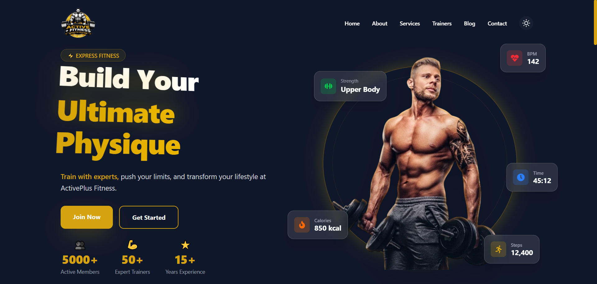
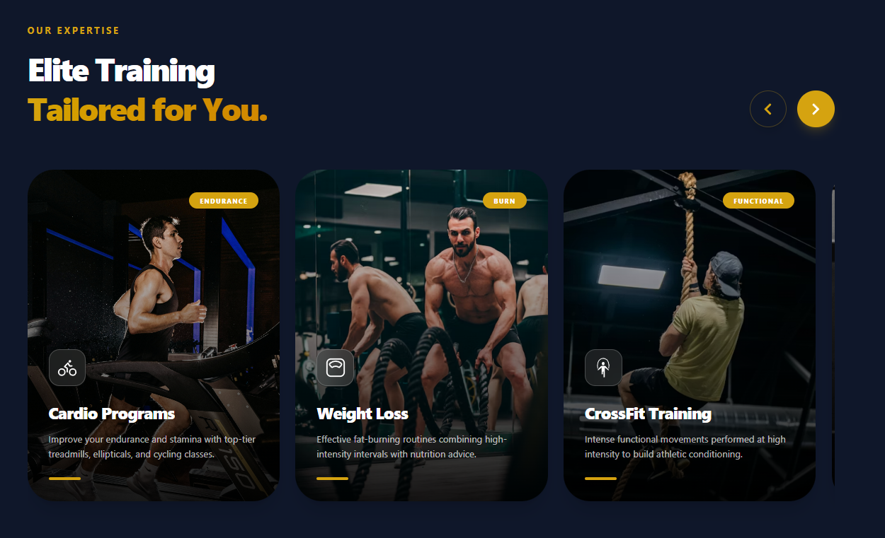
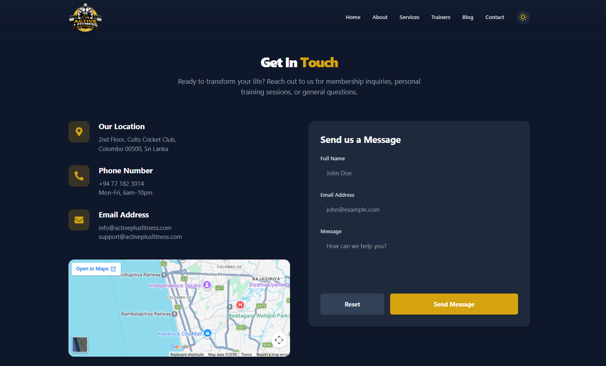
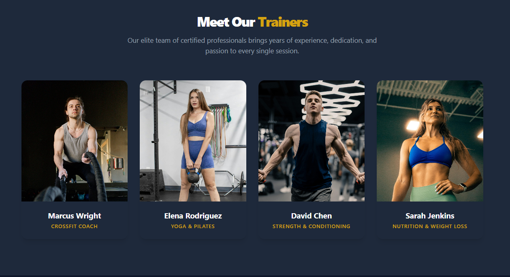

# Active+ Fitness

A highly responsive, premium promotional website for a local fitness brand launching a new gym. Designed to attract new members by beautifully showcasing the gym’s services, trainers, and allowing interested users to submit inquiries securely.

## 🔗 Project Links
- **Live Demo:** https://activeplusfitness.vercel.app
- **Figma Design:** https://www.figma.com/design/vLn7ucAGxJ5lzqEmlnPw82/Active--Fitness-Website-Design?node-id=0-1&t=WrkigBkIXxO3W2Ql-1

## 🎯 Features & Requirements
This project fulfills the core internship evaluation requirements and successfully implements all the bonus criteria:

### Core Requirements
- **Home Page Layout:** Clean, modern UI with proper usage of all provided branding assets.
- **Required Sections:** Includes Hero, About, Features/Services, and Contact sections.
- **Contact Form:**
  - Standard fields for Name, Email, and Message.
  - Native client-side validation.
  - Displays instant success feedback upon form submission.
- **Technical Specifications:**
  - Fully responsive design gracefully degrading from 4K desktop to 320px mobile screens.
  - Component-driven architecture built with React and Vite.
  - High code quality with clean folder structures.

### 🌟 Bonus Points Achieved
- **Dark Mode:** Integrated global dark/light mode toggle with native system preference detection using Tailwind CSS.
- **Search / Filter Functionality:** Available on the dedicated Blog and Destinations architecture.
- **Animations:** Extensive use of `framer-motion` for smooth page transitions, scroll-reveals, and rich micro-interactions (e.g., Hero Stats counter).
- **API Integration:** Full integration with Supabase (backend as a service).
- **Advanced Form Handling:** Implementation of `react-hot-toast` for robust, animated success/error popups, strong form validation logic, database insertions, and a built-in form reset utility. Includes a secure custom **Admin Dashboard** to securely review submissions!

## 🛠️ Tech Stack
- **Frontend Framework:** React 19 + Vite
- **Routing:** React Router v7
- **Styling:** Tailwind CSS v4
- **Animations:** Framer Motion
- **Icons:** React Icons
- **Backend / Database:** Supabase (PostgreSQL)
- **Notifications & UI:** React Hot Toast
- **Deployment:** Vercel

## 🚀 Setup Instructions

1. **Clone the repository**
   ```bash
   git clone https://github.com/manuka8/ActivePlusFitness.git
   cd ActivePlusFitness
   ```

2. **Install dependencies**
   ```bash
   npm install --legacy-peer-deps
   ```

3. **Configure Environment Variables**
   Create a `.env` file in the root directory and securely add your Supabase credentials to enable the Contact Form and Admin Panel:
   ```env
   # Required for Contact Form database insertion
   VITE_SUPABASE_URL=YOUR_SUPABASE_PROJECT_URL_HERE
   VITE_SUPABASE_ANON_KEY=YOUR_SUPABASE_ANON_KEY_HERE
   
   # Admin Dashboard Login
   VITE_ADMIN_USER=admin
   VITE_ADMIN_PASS=admin123
   ```

4. **Start the development server**
   ```bash
   npm run dev
   ```
   Open `http://localhost:5173` in your browser to view the application natively.

---

## 🧪 Quality Assurance & Testing

A comprehensive **Test Case Report** has been meticulously prepared to ensure the highest standards of quality, performance, and functionality across all devices. 

> 📁 **[View the full Test Case Report here](./Test_Case_Report.xlsx)** 

Testing priorities included:
- **UI/UX Integrity:** Validating exact layout matching with Figma designs.
- **Form Validations:** Ensuring robust security and error handling for the Contact Form & Supabase backend.
- **Cross-browser Compatibility:** Testing animations and responsiveness on Chrome, Safari, and Mobile devices.

---

## 📸 Screenshots

- **Home Page / Hero Section:**
  
  
- **Features & Services:**
  
  
- **Contact Form & Toast Popups:**
  
- **Trainers**
  
- **Blogs**
  
